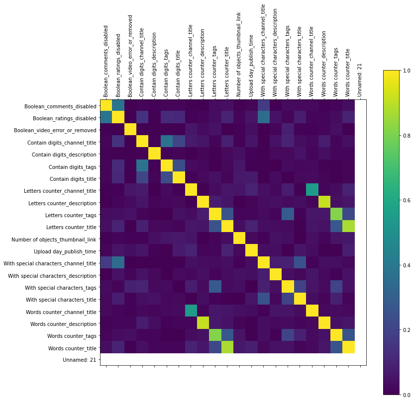
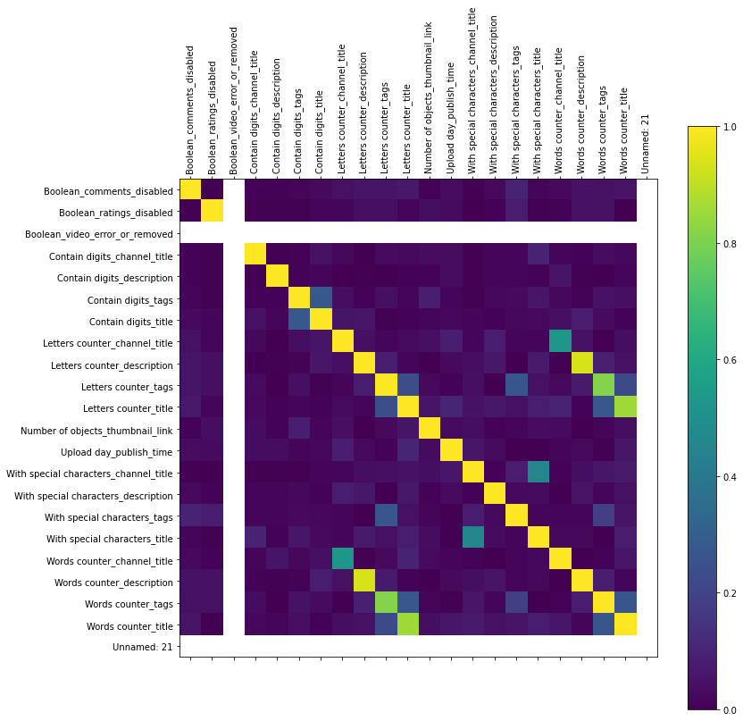

# Projekt: YouTube trending videos

### Wstęp

Celem projektu jest przeprowadzenie procesu **odkrywania wiedzy** z danych dotyczących **filmów z serwisu YouTube**.
Należy wskazać, jakie atrybuty powinien mieć przysłany film, aby trafił na **kartę `"na czasie"`**.

### Etap 3 - Ocena ważności atrybutów i ich ewentualna redukcja

### Odrzucenie atrybutów, które zostały wygenerowane automatycznie, a nie wnoszą użytecznych informacji

Część atrybutów została odrzucona już we wcześniejszych etapach.  
Są to atrybuty, które zostały wygenerowane automatycznie, a nie wnoszą użytecznych informacji.  
Przykładem jest np.:
* badanie **wielkości liter** dla kolumny *publish_time*
* **liczba wyrazów** dla *ratings_disabled*


### 1. Znalezienie korelacji między atrybutam 

Do wykonania tego kroku, trzeba zmodyfikować dane wejściowe, dodając kolumny z wyliczonymi atrybutami.  
Do tej pory, były one jedynie sumowane i zapisywane w pliku `json`. 

Liczba atrybutów przed ich redukcją jest na tyle duża, że próba ich wyliczenia i zapisu dla całego zbioru danych, mogłaby się nie udać w związku z długim czasem przetwarzania. Byłoby to szczególnie problematyczne dla atrybutów graficznych. 
W związku z tym, zostanie wybrana reprezentatywna próbka zbioru (po **1000 rekordów**). Dalsze kroki, mające na celu redukcję atrybutów będą wykonywane właśnie na tej próbce. 

Atrybuty nieuwzględnione:  
* Common words_category_id, Contain digits_category_id itd. - ze względu na dużą liczbę braków
* Common words_channel_title	Common words_description	Common words_tags	Common words_title
* Objects_thumbnail_link 
* Main colors_thumbnail_link
* Has text_thumbnail_link


```python
import glob
import os
import pandas as pd
import csv
import matplotlib.pyplot as plt
import numpy

def get_correlation(filename):
    d = pd.read_csv(filename, sep=';')
    names = list(d.columns) 
    corr = d.corr().abs()
    corr.style.background_gradient(cmap='coolwarm')
    return corr, names

files = ['summary_GB_videos_5p.csv', 'summary_US_videos_5p.csv']

for _file in files:
    correlations, names = get_correlation(_file)
    
    # print matrix
#     print(correlations)
    
    # plot correlation matrix
    fig = plt.figure(figsize=(12, 12))
    ax = fig.add_subplot(111)
    cax = ax.matshow(correlations, vmin=0, vmax=1)
    fig.colorbar(cax)
    ticks = numpy.arange(0,len(names),1)
    ax.set_xticks(ticks)
    ax.set_yticks(ticks)
    ax.set_xticklabels(names, rotation='vertical')
    ax.set_yticklabels(names)
    plt.show()
```








Pary atrybutów z najwyższą korelacją:


```python
def get_redundant_pairs(df):
    '''Get diagonal and lower triangular pairs of correlation matrix'''
    pairs_to_drop = set()
    cols = df.columns
    for i in range(0, df.shape[1]):
        for j in range(0, i+1):
            pairs_to_drop.add((cols[i], cols[j]))
    return pairs_to_drop

def get_top_abs_correlations(df, n=5):
    au_corr = df.corr().abs().unstack()
    labels_to_drop = get_redundant_pairs(df)
    au_corr = au_corr.drop(labels=labels_to_drop).sort_values(ascending=False)
    return au_corr[0:n]

get_top_abs_correlations(correlations, 15)
```


    Letters counter_description            Words counter_description        0.996445
    Letters counter_title                  Words counter_title              0.983084
    Letters counter_tags                   Words counter_tags               0.971013
    Letters counter_channel_title          Words counter_channel_title      0.787337
    With special characters_channel_title  With special characters_title    0.705705
    Contain digits_tags                    Contain digits_title             0.434369
    Letters counter_tags                   With special characters_tags     0.371703
    Letters counter_title                  Words counter_tags               0.370193
    Words counter_tags                     Words counter_title              0.368478
    Letters counter_tags                   Letters counter_title            0.323643
                                           Words counter_title              0.317780
    With special characters_tags           Words counter_tags               0.292752
    Letters counter_channel_title          Words counter_tags               0.213378
                                           Letters counter_tags             0.196401
    Letters counter_title                  Words counter_description        0.184527
    dtype: float64


Można zauważyć, że najbardziej powiązane są pary atrybutów **liczba znaków** - **liczba wyrazów** dla tych samych kolumn.  
Zatem jeden z tych atrybutów został dodany niepotrzebnie.

Ciekawe jest powiązanie **special characters_channel_title** - **special characters_title**.
Może to oznaczać, że wykrywanie atrybutów zawierających informacje o znakach specjalnych zostały błędnie zaimplementowane.
Prawdopodobnie, są to zawsze znaki, które przedstawiają **egzotyczny alfabet** - nazwa kanału jest zapisana w tym samym języku, co tytuł filmu.

Być może warto dodać wykrywanie języków tekstu oraz poprawić wykrywanie znaków specjalnych, aby znajdowane były jedynie emotikony.

### 2. Znalezienie entropii

Warto zostawić jedynie takie atrybuty, dla których entropia jest bliska 0, ponieważ będzie to oznaczało, że można określić, jakich wartości używać, aby film trafił na kartę "na czasie".


```python
import numpy as np
from scipy.stats import entropy

def _entropy(df, base=None):
    e_list = []
    
    for column in df:
        try:
            labels = df[column]
            value,counts = np.unique(labels, return_counts=True)
            e_list.append([column, entropy(counts, base=base)])
        except Exception as e:
            print(str(e))
            pass
    return sorted(e_list, key=lambda tup: tup[1])

for _file in files:
    df = pd.read_csv(_file, sep=';')
    e = _entropy(df)
    print(f'\n{_file}')
    print(*e, sep='\n')
    print('\n')

```

    
    summary_GB_videos_5p.csv
    ['Boolean_video_error_or_removed', 0.014603436691339981]
    ['With special characters_channel_title', 0.014603436691339981]
    ['Boolean_ratings_disabled', 0.02639079451281286]
    ['Contain digits_description', 0.04714115214067802]
    ['Contain digits_channel_title', 0.061249273239873725]
    ['Boolean_comments_disabled', 0.07877222303325442]
    ['Contain digits_tags', 0.07877222303325442]
    ['Contain digits_title', 0.08709952319177525]
    ['With special characters_title', 0.13971321718058982]
    ['Words counter_channel_title', 0.17294011604638437]
    ['With special characters_tags', 0.2180565982150504]
    ['With special characters_description', 0.24026567158620693]
    ['Letters counter_channel_title', 0.950048200589313]
    ['Words counter_title', 1.124789774655347]
    ['Number of objects_thumbnail_link', 1.393355085165303]
    ['Upload day_publish_time', 1.867361577375744]
    ['Letters counter_title', 2.0745638594373186]
    ['Words counter_tags', 2.2032848065402737]
    ['Words counter_description', 3.8671927252609652]
    ['Letters counter_tags', 3.917457248518171]
    ['Letters counter_description', 5.174893352094106]
    ['Unnamed: 21', 6.893656354602635]
    
    
    
    summary_US_videos_5p.csv
    ['Boolean_video_error_or_removed', 0.0]
    ['Boolean_ratings_disabled', 0.020723711095966612]
    ['With special characters_channel_title', 0.020723711095966612]
    ['Contain digits_channel_title', 0.03720727288250013]
    ['Contain digits_description', 0.03720727288250013]
    ['Contain digits_tags', 0.07034306623108758]
    ['With special characters_title', 0.07469130576591929]
    ['Boolean_comments_disabled', 0.07896576968912004]
    ['With special characters_description', 0.13300513069521022]
    ['Words counter_channel_title', 0.1537166986925479]
    ['With special characters_tags', 0.1701364012377995]
    ['Contain digits_title', 0.18279011824588237]
    ['Letters counter_channel_title', 0.9405263551459659]
    ['Words counter_title', 1.0956652662998028]
    ['Number of objects_thumbnail_link', 1.527645680660425]
    ['Upload day_publish_time', 1.9179850432335315]
    ['Letters counter_title', 2.055012307862616]
    ['Words counter_tags', 2.2618516706457332]
    ['Letters counter_tags', 3.9391187030336186]
    ['Words counter_description', 4.137636363958193]
    ['Letters counter_description', 5.299223033817112]
    ['Unnamed: 21', 6.890609120147168]
    
    
    

Korzystając z entropii można stwierdzić, że bardzo opłaca się korzystać z atrybutów typu **bool**.
Pozwala to jednoznacznie stwierdzić, czego nie powinno się robić umieszczając film, a co jest wręcz konieczne.


### 3. Atrybuty nieuwzględnione

* **TextAnalyzer** - wykryty tekst nie nadaje się do analizy. Być może jest to wina zastosowanej biblioteki, lub słabej jakości obrazów. Atrybuty z tej kolumny zostaną pominięte.

* **ObjectsNamesAnalyzer** - często rozpoznawany jest **człowiek** (727/1000 oraz 721/100). Pozwala to na dostarczenie cennych informacji.

* **ColorsAnalyzer** - ten **analyzer** również wymaga wprowadzenia poprawek (w końcowym etapie). Na tę chwilę wiadomo, że obraz powinien zawierać głównie różne odcienie szarości. Jest to cenna informacja, ale wymaga dalszej analizy.

## Podsumowanie

#### Atrybuty odrzucone:

* **Zliczanie liczby wyrazów** (dla każdej z kolumn) - ze względu na wysoką wartość korelacji z liczbą liter.
* **Zliczanie liczby liter** (dla wszystkich kolumn, poza **tytułem**) - ze względu na wysoką wartość entropii. Liczba liter **tagów** oraz **opisów** jest bardzo zróżnicowana, co może świadczyć, o nieistotności tego atrybutu.
* **Znaki specjalne** - wykrywanie znaków specjalnych w obecnej formie nie ma sensu. Wysoka korelacja tego atrybutu pomiędzy różnymi kolumnami może wskazywać na to, że znaki specjalne wskazują jedynie na wykorzystanie języków, które nie korzystają z alfabetu łacińskiego. Można jedynie zaznaczyć (klientowi), że zaleca się ich nie używać.
* **Tekst na miniaturach** - wyjaśnienie wyżej (do rozwinięcia w końcowym sprawozdaniu)
* **Analiza kolorów na miniaturach** - podanie klientowi bardziej w formie ciekawostki - nie należy przykładać do niego wielkiej wagi (również do rozwinięcia w końcowym sprawozdaniu)
* **Czas przesłania filmu** - W tym przypadku również występuje duża rozpiętość wartości. Być może także warto odrzucić, lub podać klientowi w formie "zalecenia" (wskazówki), którego nie trzeba przestrzegać za wszelką cenę.
